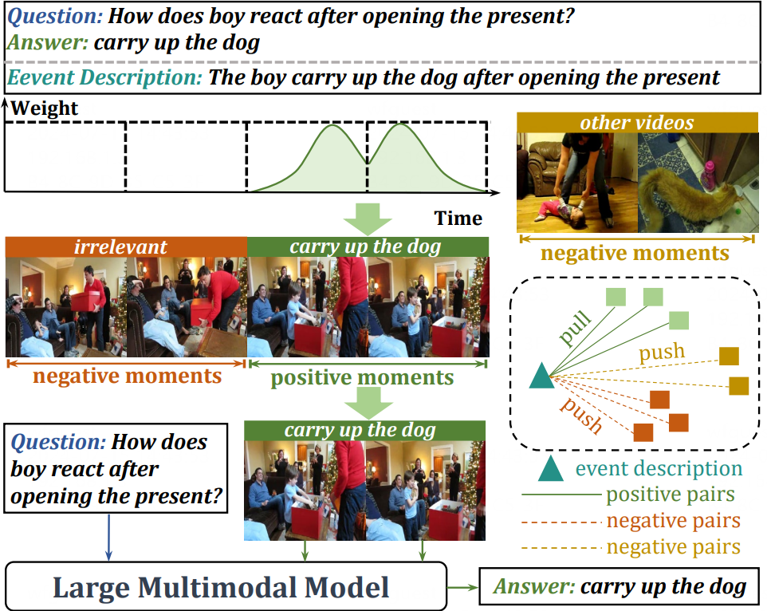
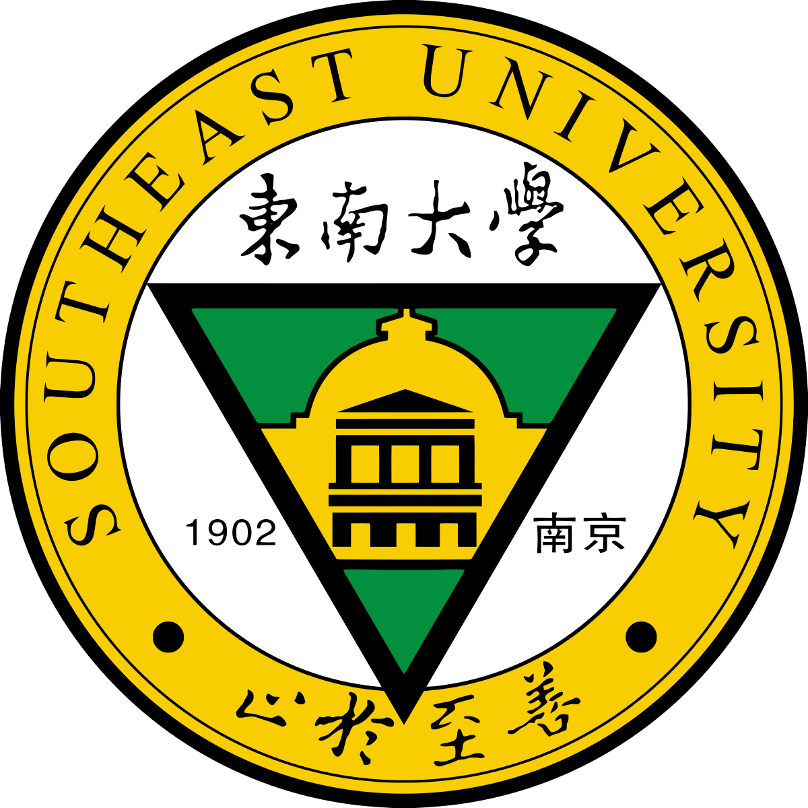
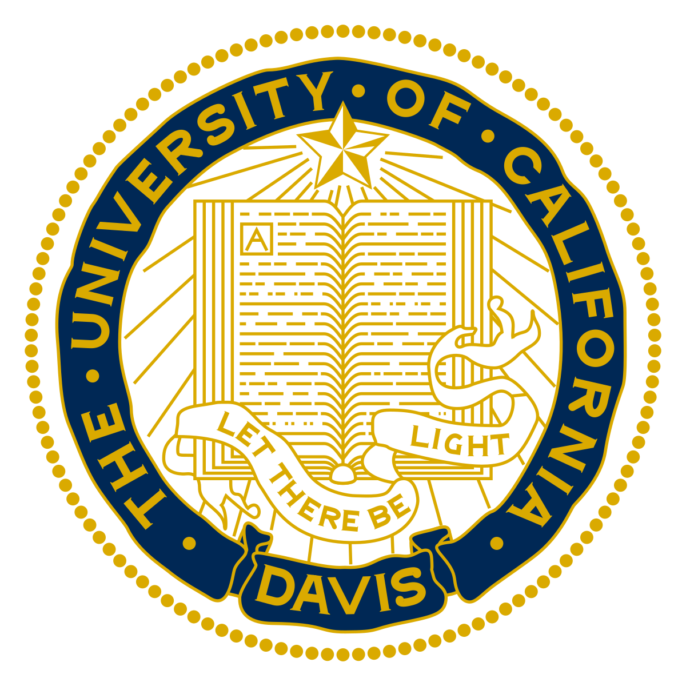








I am a third-year Master's student at [CS Department, Fudan University](https://cs.fudan.edu.cn/) advised by Prof. [Weifeng Ge](https://www.weifengge.net/). Previously, I received my Bachelor’s Degree in the [CS Department, Southeast University](https://cse.seu.edu.cn/), where I worked with Prof. [Ding Ding](https://dingdingseu.mystrikingly.com/). My research primarily focuses on **Vision-Language Reasoning** (Visual Question Answering, Multimodal Large Langauge Models, etc.). I'm currently working with Prof. <a href="https://wilburone.github.io/">Lifu Huang</a> on building unified models for video understanding and generation.

> I am looking for a potential Ph.D. position enrolling in Fall 2025. Welcome to reach out to me if interested :)

<!--
🔥 News
------
- **_[2024.7]_** **_One first-authored paper accepted by ACM MM 2024._**
- **_[2024.7]_** **_One first-authored paper accepted by ECCV 2024._**
 -->

📝 Publications and Preprints
------
### _Grounded-VideoLLM: Sharpening Fine-grained Temporal Grounding in Video Large Language Models._ [Preprint] [[Paper]](https://arxiv.org/abs/2410.03290) [[Code]](https://github.com/WHB139426/Grounded-Video-LLM)
**Haibo Wang**, Zhiyang Xu, Yu Cheng, Shizhe Diao, Yufan Zhou, Yixin Cao, Qifan Wang, Weifeng Ge, Lifu Huang. 

### _Weakly Supervised Gaussian Contrastive Grounding with Large Multimodal Models for Video Question Answering._ [ACM Multimedia 2024] [[Paper]](https://arxiv.org/abs/2401.10711) [[Code]](https://github.com/WHB139426/GCG)
**Haibo Wang**, Chenghang Lai, Yixuan Sun, Weifeng Ge. 
<!----->
  
### _Q&A Prompts: Discovering Rich Visual Clues through Mining Question-Answer Prompts for VQA requiring Diverse World Knowledge._ [ECCV 2024] [[Paper]](https://arxiv.org/abs/2401.10712) [[Code]](https://github.com/WHB139426/QA-Prompts)
**Haibo Wang**, Weifeng Ge. 

### _Pixel level Semantic Correspondence through Layout aware Representation Learning and Multi scale Matching Integration._ [CVPR 2024] [[Paper]](https://openaccess.thecvf.com/content/CVPR2024/papers/Sun_Pixel-level_Semantic_Correspondence_through_Layout-aware_Representation_Learning_and_Multi-scale_Matching_CVPR_2024_paper.pdf)
Yixuan Sun\*, Zhangyue Yin\*, **Haibo Wang**, Yan Wang, Xipeng Qiu, Weifeng Ge, Wenqiang Zhang.

### _Object-Centric Cross-Modal Knowledge Reasoning for Future Event Prediction in Videos._ [IEEE TCSVT 2024] [[Paper]](https://ieeexplore.ieee.org/document/10638077)
Chenghang Lai, **Haibo Wang**, Weifeng Ge, Xiangyang Xue. 

### _IVRSandplay: An Immersive Virtual Reality Sandplay System Coupled with Hand Motion Capture and Eye Tracking._ [CSCWD 2023] [[Paper]](https://ieeexplore.ieee.org/document/10152562)
**Haibo Wang**, Ding Ding, Yuhao Liu, Chi Wang. 

🎖 Honors and Awards
------
- *2024.10*, [China National Scholarship (Top 1%)](https://cs.fudan.edu.cn/9d/f0/c24257a695792/page.htm)
  
👩‍💻 Academic Services
------
- Reviewer: ICLR 2025.

📖 Educations
------

  
  

    <b>2022.09 - 2025.06 (expected)</b>, Graduate student, Fudan University, Shanghai.
  

  
  

    <b>2018.09 - 2022.06</b>, Undergraduate student, Southeast University, Nanjing.
  

💻 Experience
------

  
  

    <b>2024.05 -</b>, Research intern, University of California, Davis.
  

  
  

    <b>2024.05 - 2024.07</b>, Intern, OPPO AI Research, Shanghai

    

------

